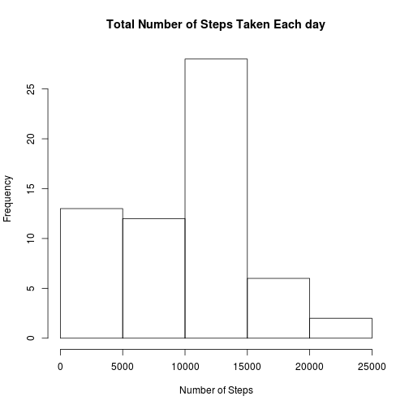
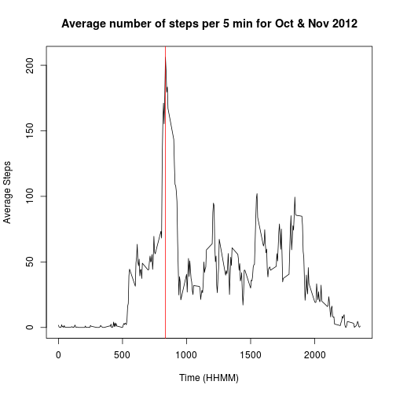
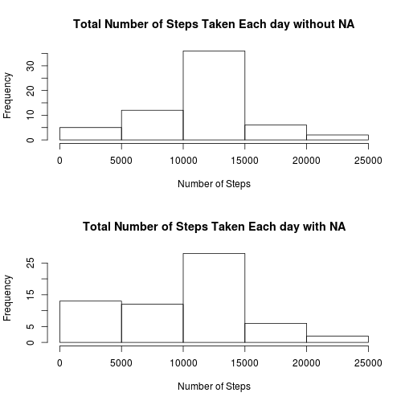
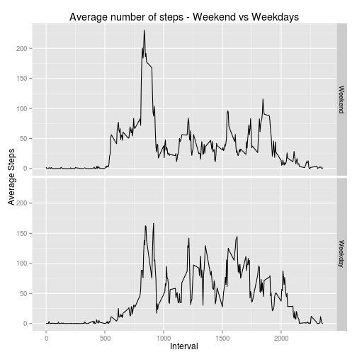

# Report on Personnel Activity Data
=============================================================================
<br><br>

<br>
<br>

## 1. Loading and preprocessing the data

<br><br>
I used dplyr and ggplot2 packages for producing this report.
The following code loads required libraries

```r
#I do not see a point in echoing this code but this is required as per the #instruction.
library(dplyr)
library(ggplot2)
```
<br>
The following code downloads the zip file from internet and 
extract the data file if it does not exist

```r
#download the file if the zip file does not exist in the working directory
if (!file.exists("activity.zip"))
{
    download.file(
        "https://d396qusza40orc.cloudfront.net/repdata%2Fdata%2Factivity.zip",destfile = "activity.zip"
    )
}

# extract the zip file if the csv file does not exist
if (!file.exists('activity.csv'))
{
    unzip("activity.zip",exdir = "./")
    
}
```
<br>
The following code reads the data if its not already in the environment
<br>

```r
if (!'activitydata' %in% ls())
{
    activitydata <- read.csv('activity.csv')
}
```
<br>
<br><br>


### Preprocessing:
#### The following code reshape the dataframe and identify total number of steps per day

<br>

```r
activityperday <- group_by(activitydata, date)
#calculate total steps
activitysummary <-
    summarise(activityperday,totalsteps = sum(steps, na.rm = TRUE))
head(activitysummary,5)
```

```
## Source: local data frame [5 x 2]
## 
##         date totalsteps
##       (fctr)      (int)
## 1 2012-10-01          0
## 2 2012-10-02        126
## 3 2012-10-03      11352
## 4 2012-10-04      12116
## 5 2012-10-05      13294
```
<br><br> 

#### The following code reshapes the data frame and identifies the average steps per 5 min interval across the month of Nov and Dec.

```r
activitymin <- activitydata[,c('steps', 'interval')]
# group the data
activitypermin <- group_by(activitymin, interval)
#calculate mean
activityperminsum <-
    summarise(activitypermin, avgsteps = mean(steps, na.rm = TRUE))
head(activityperminsum,5)
```

```
## Source: local data frame [5 x 2]
## 
##   interval  avgsteps
##      (int)     (dbl)
## 1        0 1.7169811
## 2        5 0.3396226
## 3       10 0.1320755
## 4       15 0.1509434
## 5       20 0.0754717
```
<br><br> 
<br><br> 

## 2. What is mean total number of steps taken per day?

<br><br> 

#### 2.1 - Total number of steps taken per day for first 5 days

```r
head(activitysummary,5)
```

```
## Source: local data frame [5 x 2]
## 
##         date totalsteps
##       (fctr)      (int)
## 1 2012-10-01          0
## 2 2012-10-02        126
## 3 2012-10-03      11352
## 4 2012-10-04      12116
## 5 2012-10-05      13294
```
<br><br> 

#### 2.2 Histogram of the total number of steps taken each day

```r
hist(activitysummary$totalsteps,main = 'Total Number of Steps Taken Each day', xlab = 'Number of Steps')
```

 
<br><br> 

#### 2.3 Mean and Median of total steps per day
##### 2.3.1  Here is the mean of total stpes per day

```r
mean(activitysummary$totalsteps)
```

```
## [1] 9354.23
```
##### 2.3.2 Here is the median of totalsteps  per day

```r
median(activitysummary$totalsteps)
```

```
## [1] 10395
```
<br><br> 
<br>

## 3. What is the average daily activity pattern?
<br><br> 

#### 3.1 The following graph shows the activity pattern of individuals during a day for the month of Oct and Nov 2012. 

```r
plot(
    activityperminsum$interval, activityperminsum$avgsteps, type = 'l',
    main = 'Average number of steps per 5 min for Oct & Nov 2012', xlab = 'Time (HHMM)',
    ylab = 'Average Steps'
)

# Draw verticle line to show the max average steps
abline(v = activityperminsum[activityperminsum$avgsteps == max(activityperminsum$avgsteps),1],
       col = 'red')
```

 
<br><br> 

#### 3.2 Which 5-minute interval, on average across all the days in the dataset, contains the maximum number of steps?

```r
#print time interval for max average steps
print(activityperminsum[activityperminsum$avgsteps == max(activityperminsum$avgsteps),])
```

```
## Source: local data frame [1 x 2]
## 
##   interval avgsteps
##      (int)    (dbl)
## 1      835 206.1698
```
<br><br> 
<br>

## 4 Imputing missing values
<br><br> 


#### 4.1 Total number of missing values in the dataset:

```r
#Total number of NA
sum(is.na(activitydata$steps))
```

```
## [1] 2304
```
<br><br> 

#### 4.2  Strategy for filling in all of the missing values in the dataset
My Strategy is to use average number of steps for the missing interval (over
Oct and Nov 2012) instead of ignorng the missing values. I prefer this as this
would reflect a human activity pattern more than any other strategy.

```r
# Merge average steps per interval with the main data set
activitynona <- merge(activitydata, activityperminsum, all = TRUE)

#replace NA with average number of steps for that interval over oct and Nov 2012
activitynona$steps[which(is.na(activitynona$steps))] <-
    activitynona$avgsteps[which(is.na(activitynona$steps))]
```
<br><br> 

#### 4.3 New dataset that is equal to the original dataset but with the missing data filled in
Top 5 rows of the new dataset is shown below,

```r
#new activity data without na and average steps column
newactivitydata <- activitynona[,1:3]
head(newactivitydata,5)
```

```
##   interval    steps       date
## 1        0 1.716981 2012-10-01
## 2        0 0.000000 2012-11-23
## 3        0 0.000000 2012-10-28
## 4        0 0.000000 2012-11-06
## 5        0 0.000000 2012-11-24
```
<br><br> 

##### 4.4.1 Histogram of the total number of steps taken each day:
The following histograms shows the difference between total number of steps
with NA and without NA & impact of imputing missing values.

```r
#activity per day summary with  new data
newactivityperday <- group_by(newactivitydata, date)
#total number of steps each day summary
newactivitysummary <-
    summarise(newactivityperday,totalsteps = sum(steps, na.rm = TRUE))

#plot histogram comparision
par(mfrow=c(2,1))
hist(newactivitysummary$totalsteps,main = 'Total Number of Steps Taken Each day without NA', xlab = 'Number of Steps')
hist(activitysummary$totalsteps,main = 'Total Number of Steps Taken Each day with NA', xlab = 'Number of Steps')
```

 
<br><br> 

##### 4.4.2 Mean and median total number of steps taken per day with imputing NA values
Mean of Total Steps with NA: 

```r
#mean of total stpes per day
print(mean(activitysummary$totalsteps))
```

```
## [1] 9354.23
```
<br>
Mean of Total Steps without NA: 

```r
print(mean(newactivitysummary$totalsteps))
```

```
## [1] 10766.19
```
<br>
Median of Total Steps with NA:

```r
#median of totalsteps  per day
print(median(activitysummary$totalsteps))
```

```
## [1] 10395
```
<br>
Median of Total Steps without NA:

```r
print(median(newactivitysummary$totalsteps))
```

```
## [1] 10766.19
```
<br><br> 
<br> 

## 5 Are there differences in activity patterns between weekdays and weekends?

<br><br> 

#### 5.1 Grouping data based on type of day - weekend /weekday
For grouping the data in to either weekdays or weekend, I used the weekdays
function and marked the records as weekend data if the day falls in either 
Saturday or Sunday. All other data is marked as weekday data. I printed top 5 
records of the new data frame newactivitydataw

```r
#add weekday column to the activity data
newactivitydataw <-
    mutate(newactivitydata, weekday = factor(1 * (
        weekdays(as.Date(date)) %in% c('Saturday', 'Sunday')
    ), labels = c('Weekend', 'Weekday')))

head(newactivitydataw,5)
```

```
##   interval    steps       date weekday
## 1        0 1.716981 2012-10-01 Weekend
## 2        0 0.000000 2012-11-23 Weekend
## 3        0 0.000000 2012-10-28 Weekday
## 4        0 0.000000 2012-11-06 Weekend
## 5        0 0.000000 2012-11-24 Weekday
```
<br><br> 

#### 5.2 Time series plot of the 5-minute interval and the average number of steps taken, averaged across all weekday days or weekend days
I grouped the data based on Weekday and interval and calculated the average
using the following code,

```r
#group by weekday and interval 
newactivitydatawg<-group_by(newactivitydataw, weekday, interval)
#summarise and caluclate average over weekda and interval
newactivitydatawgs<-summarise(newactivitydatawg, avgsteps = mean(steps,na.rm = TRUE))
head(newactivitydatawgs,5)
```

```
## Source: local data frame [5 x 3]
## Groups: weekday [1]
## 
##   weekday interval   avgsteps
##    (fctr)    (int)      (dbl)
## 1 Weekend        0 2.25115304
## 2 Weekend        5 0.44528302
## 3 Weekend       10 0.17316562
## 4 Weekend       15 0.19790356
## 5 Weekend       20 0.09895178
```
<br> 
I used ggplot2 package to show the difference of pattern between weekday and 
weekend

```r
#plot
g<-ggplot(data = newactivitydatawgs,aes(interval,avgsteps))+facet_grid(weekday~.)
g<-g+geom_line()+ ggtitle('Average number of steps - Weekend vs Weekdays')
g<-g+xlab('Interval')+ylab('Average Steps')
print(g)
```

 
<br>
   
